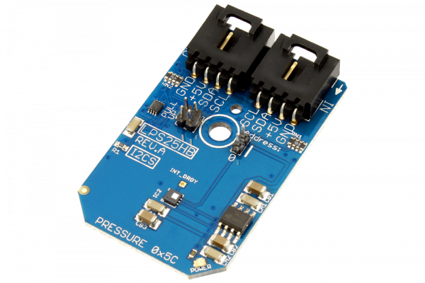

# LPS25HB

The LPS25HB, manufactured by STMicroelectronics, is absolute pressure sensor which functions as a digital output barometer. It is guaranteed to operate over a temperature range of -30 to +105 °C. This device comprises a sensing element and an IC interface which communicates through I2C from the sensing element to the application. Possible application include enhanced GPS, weather station equipment, etc.
This Device is available from www.ncd.io 

[SKU: LPS25HB_I2CS]

(https://store.ncd.io/product/lps25hb-mems-pressure-sensor-260-1260-hpa-absolute-digital-output-barometer-i2c-mini-module/)
This Sample code can be used with Arduino.

Hardware needed to interface LPS25HB sensor with Arduino

1. <a href="https://store.ncd.io/product/i2c-shield-for-arduino-nano/">Arduino Nano</a>

2. <a href="https://store.ncd.io/product/i2c-shield-for-arduino-micro-with-i2c-expansion-port/">Arduino Micro</a>

3. <a href="https://store.ncd.io/product/i2c-shield-for-arduino-uno/">Arduino uno</a>

4. <a href="https://store.ncd.io/product/dual-i2c-shield-for-arduino-due-with-modular-communications-interface/">Arduino Due</a>

5. <a href="https://store.ncd.io/product/lps25hb-mems-pressure-sensor-260-1260-hpa-absolute-digital-output-barometer-i2c-mini-module/">LPS25HB Pressure Sensor</a>

6. <a href="https://store.ncd.io/product/i%C2%B2c-cable/">I2C Cable</a>

LPS25HB:

The LPS25HB, manufactured by STMicroelectronics, is absolute pressure sensor which functions as a digital output barometer. It is guaranteed to operate over a temperature range of -30 to +105 °C. This device comprises a sensing element and an IC interface which communicates through I2C from the sensing element to the application. Possible application include enhanced GPS, weather station equipment, etc.

Applications:

• Altimeter and barometer for portable devices

• Enhanced GPS applications

• Weather station equipment

• Wearable devices

How to Use the LPS25HB Arduino Library

The LPS25HB has a number of settings, which can be configured based on user requirements.

1.Address calling:The following command is used to call the address of LPS25HB sensor to begin the transmission.

           lps.getAddr_LPS25HB(LPS25HB_DEFAULT_ADDRESS_BARO);           // 0x5C
          
2.Data rate setting:The following command is used to set the data rate.

           lps.setBaroDataRate(BARO_DATARATE_1HZ);             // Pressure (Hz): 1, Temperature (Hz): 1
            
